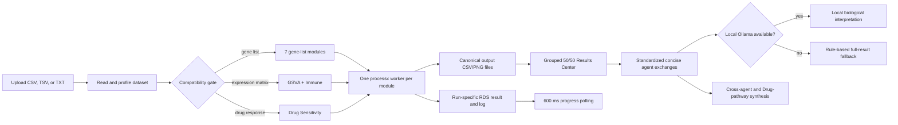

# OncoProfilingTools

OncoProfilingTools is an R package and Shiny research application for oncology profiling workflows. The package provides Bioconductor-style assay containers and DepMap/PRISM loading utilities; the Shiny application exposes ten analysis modules behind one upload, compatibility, background-worker, progress, and Results Center workflow.

The Results Center combines deterministic R analyses with optional biological interpretation from a local Ollama server. Ollama is restricted to loopback hosts and the deterministic full-result summary remains available whenever the model is disabled, unavailable, or returns an invalid response.

> Research use only. Biological findings require expert validation.

## Implemented analysis modules

| Module | Active Shiny backend | Required input | Saved table | Saved visualization |
|---|---|---|---|---|
| GO | `clusterProfiler::enrichGO`, Biological Process ontology | Gene list | `output/cms4/go_results.csv` | `output/visualizations/go_biological_process_dotplot.png` |
| KEGG | `clusterProfiler::enrichKEGG`, human organism code `hsa` | Gene list | `output/cms4/kegg_results.csv` | `output/visualizations/kegg_pathway_dotplot.png` |
| Reactome | `ReactomePA::enrichPathway` | Gene list | `output/reactome/reactome_results.csv` | `output/reactome/reactome_pathways.png` |
| WikiPathways | Low-memory hypergeometric enrichment over the current human WikiPathways GMT | Gene list | `output/wikipathways/wikipathways_results.csv` | `output/wikipathways/wikipathways_pathways.png` |
| STRING | `STRINGdb` mapping and interaction retrieval; top hubs ranked by degree | Gene list | `output/string/string_hub_proteins.csv` plus `string_interactions.csv` | `output/string/string_network.png` |
| Hallmark | `msigdbr` Hallmark collection plus `clusterProfiler::enricher` | Gene list | `output/hallmark/hallmark_results.csv` | `output/hallmark/hallmark_pathways.png` |
| ChEA | `enrichR` database `ChEA_2022` | Gene list | `output/chea_cms4/chea_results.csv` | `output/chea_cms4/chea_tf_dotplot.png` |
| GSVA | `GSVA` over the MSigDB Hallmark collection; Gaussian kernel | Expression matrix | `output/gsva_bowel/gsva_hallmark_scores.csv` | `output/gsva_bowel/gsva_hallmark_heatmap.png` |
| Immune Deconvolution | `immunedeconv::deconvolute`, default method `quantiseq` | Expression matrix | `output/immune/immune_cell_composition.csv` | Not generated |
| Drug Sensitivity | In-process ranking of long-form response tables or wide PRISM-style tables | Drug-response table | `output/drug/drug_sensitivity_results.csv` | Not generated |

The package-level `R/agent-wikipathways.R` uses the MSigDB WikiPathways collection. The active Shiny executor reads the current official human WikiPathways GMT, prefers an uploaded Entrez-ID column, and otherwise maps HGNC symbols through the installed `org.Hs.eg.db` SQLite database without loading the full annotation stack.

## Workflow



The application:

- accepts `.csv`, `.tsv`, and `.txt` uploads up to the configured 1 GB Shiny request limit;
- validates that the table is non-empty;
- profiles gene-list, expression-matrix, and drug-response compatibility;
- converts DEG-style tables into a bounded analysis signature using adjusted p-values and/or effect sizes when those columns are present, instead of treating a near-whole-genome table as an enrichment list;
- disables incompatible module selectors and automatically checks compatible modules;
- saves the uploaded table once per run as `shiny-app/runtime/<run-id>/input.rds`;
- launches selected modules independently with `processx`;
- polls worker result files every 600 ms and Results Center files every 750 ms;
- reports queued, running, completed, failed, and not-executed states;
- groups the seven gene-list agents separately from GSVA/Immune and from the dedicated Drug Sensitivity section;
- presents every result tab as graph plus table on the left and interpretation on the right;
- displays numeric table values to two decimals while copying original full-precision CSVs for downloads;
- uses file content fingerprints and inline image data to prevent stale plot reuse;
- exposes searchable `DT` tables, available plots, per-module CSV and HTML report downloads, a combined HTML report action, and a ZIP bundle action (including the STRING edge list);
- publishes concise full-table agent exchanges to one cross-agent synthesis layer;
- kills active workers when the session ends; and
- clears known result files and earlier runtime entries at app startup, on a new upload, and before a new run.

## Local interpretation and agent exchange

`shiny-app/interpretation.R` is a UI-independent adapter between result tables and interpretation. For every selected agent it calculates row coverage, representative ranked findings, numeric ranges, and biological-program labels across the complete result table. The compact exchange schema is then shared with one synthesis layer rather than coupling scientific workers to one another.

When Drug Sensitivity and one or more pathway/systems agents are selected, `build_drug_pathway_bridge()` exposes their concise outputs together. This is an architecture hook, not a causal model: matched samples and an explicit statistical association method are still required before connecting a compound response to pathway activity.

The app sends one structured request per completed run to Ollama at the configured loopback URL. Accepted hostnames are only `localhost`, `127.0.0.1`, and `[::1]`; non-loopback values are rejected before a request can run. No result digest is sent to a cloud LLM. Existing scientific backends retain their prior behavior: modules such as ChEA, STRING, KEGG, and WikiPathways may contact their public reference services, so use only locally cached/offline-compatible modules when the complete scientific workflow must run without any network access.

See [`docs/results-center-architecture.md`](docs/results-center-architecture.md) for the exchange contract, safety behavior, and extension points.

## Compatibility rules

The active compatibility logic is in `shiny-app/app.R`.

### Gene-list modules

A gene-list table is compatible when:

1. a column name normalizes to one of `genesymbol`, `hugosymbol`, `gene`, `genes`, `symbol`, `genename`, or `hgncsymbol`; and
2. at least two cleaned, unique gene values remain after automatic preparation.

For DEG-style tables, the app detects adjusted p-value/FDR/q-value columns and effect columns such as `log2FoldChange`, `logFC`, or `diff_*`. It uses p ≤ 0.05 where available, |effect| ≥ 1 where available, and keeps at most the 2,000 strongest rows. Positive and negative effects are combined, and the exact selection appears beside the upload metrics. Run separate up- and down-regulated files when a directional biological interpretation is required. Unranked lists over 5,000 genes are rejected with guidance because near-whole-genome over-representation analysis is not meaningful.

Compatible modules: GO, KEGG, Reactome, WikiPathways, STRING, Hallmark, and ChEA.

### Expression modules

The active UI gate requires:

- at least 10 columns in the uploaded table;
- at least 10 cleaned genes from a recognized gene column; and
- at least two columns whose values are at least 80% numeric.

Compatible modules: GSVA and Immune Deconvolution.

The executor ultimately requires genes in rows and at least two numeric sample columns. The current UI gate is stricter than the executor. The local `data/OmicsExpression_Bowel_TPMLogp1.csv` file is stored as samples × genes and has no recognized gene-column header, so it is not enabled by the current active UI gate when uploaded unchanged.

### Drug Sensitivity

The module is compatible with either:

- a compound column (`compound`, `compoundname`, `drug`, `drugname`, or `treatment`) plus a response column (`ic50`, `auc`, `viability`, `sensitivity`, `response`, or `lnic50`); or
- a wide table with one or more column names containing `BRD:`.

For IC50, AUC, or viability column names, lower mean response is ranked as more sensitive. Other accepted response names are ranked in descending mean order.

### CMS4 dataset

The local `data/gene_expression_CMS4.csv` has 19,215 rows, 5 columns, a detected `hugo_symbol` column, and `diff_cms4_minus_other` as an effect column. The app automatically analyzes the strongest genes with |difference| ≥ 1 (subject to the 2,000-gene cap), enables the seven gene-list modules, and does not enable GSVA, Immune Deconvolution, or Drug Sensitivity.

## Repository structure

```text
OncoProfilingTools/
├── R/                         S4 classes, assay loaders, plotting, and agent functions
├── api/plumber.R              Four-agent REST API: GO, KEGG, GSVA, ChEA
├── data/                      Local ignored datasets, including CMS4 and DepMap files
├── inst/extdata/              Small tracked example gene list
├── man/                       Generated R documentation
├── scripts/                   Dataset preparation, analysis, plotting, and legacy tests
├── shiny-app/
│   ├── app.R                  Active UI, compatibility, reactive state, and orchestration
│   ├── real_pipeline.R        Run-directory and processx helpers
│   ├── run_agent_worker.R     Single-module background worker entry point
│   ├── run_real_agents.R      Active ten-module execution backend
│   ├── results_helpers.R      Results Center and download builders
│   └── www/                   Client-side status handling and responsive styling
├── output/                    Local/ignored analysis outputs created on demand
├── DESCRIPTION                R package metadata and declared dependencies
└── NAMESPACE                  Exported package API
```

Backup snapshots, runtime fixtures, generated reports, and analysis outputs are intentionally excluded from version control. Git history and the automated tests are the source of record for earlier implementations and regressions.

## Requirements

- R 4.1.0 or newer, as declared in `DESCRIPTION`
- A browser supported by Shiny
- Optional: [Ollama](https://ollama.com/) running locally with the configured model
- Network access for backends that query or download external resources, including ChEA/Enrichr, KEGG, STRING, Reactome, MSigDB data, DepMap downloads, and package installation

The package metadata declares the core assay and enrichment dependencies. The Shiny source also directly requires packages not fully represented in `DESCRIPTION`, including `shiny`, `readr`, `DT`, `processx`, `htmltools`, `base64enc`, `enrichR`, `GSVA`, `pheatmap`, and `ggplot2`.

## Installation

From the repository root:

```r
if (!requireNamespace("pak", quietly = TRUE)) {
  install.packages("pak")
}

pak::pkg_install(".", ask = FALSE)
```

For the complete Shiny platform, verify the source-referenced runtime packages:

```r
install.packages(c(
  "shiny", "readr", "DT", "processx", "htmltools", "base64enc", "jsonlite",
  "ggplot2", "pheatmap", "enrichR", "msigdbr", "tibble",
  "dplyr", "data.table", "httr2", "openxlsx", "remotes"
))

if (!requireNamespace("BiocManager", quietly = TRUE)) {
  install.packages("BiocManager")
}

BiocManager::install(c(
  "clusterProfiler", "org.Hs.eg.db", "ReactomePA", "STRINGdb", "GSVA",
  "S4Vectors", "SummarizedExperiment", "MultiAssayExperiment",
  "SingleCellExperiment"
))

remotes::install_github("omnideconv/immunedeconv")
```

The `enumr` remote is declared in `DESCRIPTION` as `ElianHugh/enumr@main`.

## Run locally

Start the optional local model first:

```bash
ollama pull llama3.1:8b
ollama serve
```

On macOS, the Ollama application normally starts the local service automatically. If `ollama serve` reports `bind: address already in use`, the service is already running; verify it with `ollama list` instead of starting a second server.

Then start the application from another terminal:

```bash
cd /Users/bandaarjunreddy/Research/OncoProfilingTools
Rscript -e 'shiny::runApp("shiny-app", launch.browser=TRUE)'
```

To create the requested `onco` shortcut in `~/.zshrc`:

```bash
alias onco="cd /Users/bandaarjunreddy/Research/OncoProfilingTools && Rscript -e 'shiny::runApp(\"shiny-app\", launch.browser=TRUE)'"
```

Reload the shell, then run:

```bash
source ~/.zshrc
onco
```

If the repository is cloned elsewhere, replace the path in the alias.

## Using the application

1. Upload a non-empty CSV, TSV, or tab-delimited TXT file.
2. Confirm the displayed row, column, gene, and compatible-module counts.
3. Review the compatibility badges. Incompatible modules are disabled.
4. Leave all compatible modules selected or clear modules you do not want to run.
5. Select **Run analysis**.
6. Monitor the per-module progress rows and completed/failed counter.
7. Optionally expand **Local biological interpretation settings** to change the loopback host, model, or generation timeout. The default is 180 seconds for local 8B-class models.
8. Review the cross-agent synthesis and each grouped module in the Results Center.
9. Download individual full-precision CSVs, individual HTML agent reports, or the complete ZIP bundle.
10. Confirm whether each interpretation is labeled **Local AI**, **Generating**, or **Safe fallback**, and validate biological conclusions independently. Local generation runs in a background R process, so plots, tables, and downloads remain responsive.

## Package data model

The R package is broader than the Shiny interface:

- `OncoExperiment` subclasses `MultiAssayExperiment` and adds project, version, model, and graph slots.
- `ExpressionAssay`, `ProteinExpressionAssay`, `MutationAssay`, and `DrugResponseAssay` subclass `SummarizedExperiment`.
- The assay registry supports DepMap expression, protein expression, mutation, and PRISM response files plus their sidecar metadata.
- `download_assays()` queries the DepMap files API and caches downloads.
- `load_assays()` resolves registered filenames, calls the matching loader, and aligns metadata.
- `subset()` evaluates a logical expression against top-level `colData()`.
- `compare_drug_sensitivities()` runs per-drug Welch tests between two groups and returns a `DrugSensitivityComparison`.
- `export()` can write the comparison table and plots to an Excel workbook.
- `plot_donut()` visualizes categorical assay metadata.

These package utilities are not exposed as separate cards in the current Shiny interface.

## Verification status

Post-meeting sprint checks:

- `tests/testthat/test-interpretation.R` covers loopback-only hosts, realistic timeout defaults, sanitized fallback messages, complete-table exchanges, Ollama JSON parsing, and the Drug-pathway bridge;
- `tests/testthat/test-results-center.R` covers all-agent report mappings, two-decimal score display, scientific probability display without source mutation, valid Shiny tag helpers, plot content fingerprints, and combined-report coverage;
- `tests/testthat/test-agent-resilience.R` covers bounded DEG gene selection, rejection of near-whole-genome unranked lists, ChEA expired-response retries/rejection, and STRING plot creation;
- all R sources are syntax-checked, `status.js` is checked with Node when available, and `shiny-app/app.R` is sourced as an application smoke test.

Practical CMS4 smoke tests verified automatic selection of 1,403 analysis genes, 13 Hallmark results with a plot, and 30 Reactome results with a plot. Live external-service behavior remains dependent on the availability of each provider; deterministic tests cover response validation and visualization paths without committing generated outputs.

## Visual verification

The current workflow and Results Center were browser-smoke-tested at a 1280 × 720 desktop viewport and a 390 × 844 mobile viewport. The desktop Results Center retained its evidence/interpretation split without page-level horizontal overflow; the mobile layout collapsed to one column. No generated UI screenshots are committed to the repository.

## Current limitations and future work

- Extend `api/plumber.R`, whose advertised and allowed module list remains GO, KEGG, GSVA, and ChEA.
- Align the expression compatibility gate with the executor or activate the existing orientation-normalization helpers.
- Isolate canonical outputs by session/run. Runtime inputs and worker result files are run-specific, but scientific CSV/PNG destinations are global.
- Maintain separate validation fixtures for gene-list, expression-matrix, and drug-response modules because the ten modules do not share one scientifically valid input format.
