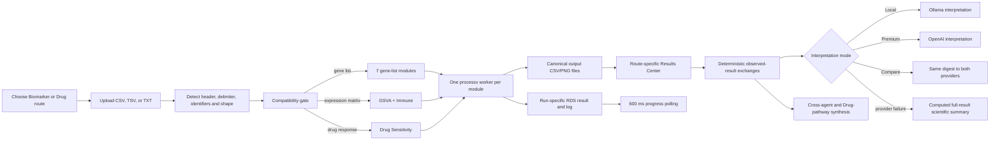

# OncoProfilingTools

OncoProfilingTools is an R package and Shiny research application for oncology profiling workflows. The package provides Bioconductor-style assay containers and DepMap/PRISM loading utilities. The Shiny application opens with two intentionally separate routes: **Biomarker Discovery** (nine agents) and **Drug Sensitivity** (one dedicated pharmacogenomic agent).

The Results Center combines deterministic R analyses with optional biological interpretation from either a local Ollama server or the OpenAI Responses API. Observed-result statements are always computed from saved tables and displayed separately from the model's interpretive context. Ollama is restricted to loopback hosts; OpenAI requires an environment-only API key plus explicit per-session data consent. The deterministic layer remains available whenever either provider is disabled, unavailable, times out, or returns an invalid/version-mismatched response.

> Research use only. Biological findings require expert validation.

## Implemented analysis modules

| Module | Active Shiny backend | Required input | Saved table | Saved visualization |
|---|---|---|---|---|
| GO | `clusterProfiler::enrichGO`, Biological Process ontology | Gene list | `output/cms4/go_results.csv` | `output/visualizations/go_biological_process_dotplot.png` |
| KEGG | `clusterProfiler::enrichKEGG`, human organism code `hsa` | Gene list | `output/cms4/kegg_results.csv` | `output/visualizations/kegg_pathway_dotplot.png` |
| Reactome | `ReactomePA::enrichPathway` | Gene list | `output/reactome/reactome_results.csv` | `output/reactome/reactome_pathways.png` |
| WikiPathways | Low-memory hypergeometric enrichment over the current human WikiPathways GMT | Gene list | `output/wikipathways/wikipathways_results.csv` | `output/wikipathways/wikipathways_pathways.png` |
| STRING | `STRINGdb` mapping and interaction retrieval; top hubs ranked by degree | Gene list | `output/string/string_hub_proteins.csv` plus `string_interactions.csv` | `output/string/string_network.png` |
| Hallmark | `msigdbr` Hallmark collection plus `clusterProfiler::enricher` | Gene list | `output/hallmark/hallmark_results.csv` | `output/hallmark/hallmark_pathways.png` |
| ChEA | `enrichR` database `ChEA_2022` | Gene list | `output/chea_cms4/chea_results.csv` | `output/chea_cms4/chea_tf_dotplot.png` |
| GSVA | `GSVA` over the MSigDB Hallmark collection; Gaussian kernel | Expression matrix | `output/gsva_bowel/gsva_hallmark_scores.csv` | `output/gsva_bowel/gsva_hallmark_heatmap.png` |
| Immune Deconvolution | `immunedeconv::deconvolute`, default method `quantiseq` | Expression matrix | `output/immune/immune_cell_composition.csv` | `output/immune/immune_composition_heatmap.png` |
| Drug Sensitivity | In-process ranking of long-form response tables or wide PRISM-style tables | Drug-response table | `output/drug/drug_sensitivity_results.csv` | `output/drug/drug_response_ranking.png` |

The package-level `R/agent-wikipathways.R` uses the MSigDB WikiPathways collection. The active Shiny executor reads the current official human WikiPathways GMT, prefers an uploaded Entrez-ID column, and otherwise maps HGNC symbols through the installed `org.Hs.eg.db` SQLite database without loading the full annotation stack.

## Workflow



The application:

- accepts `.csv`, `.tsv`, and `.txt` uploads up to the configured 1 GB Shiny request limit;
- detects headerless one-column Ensembl lists such as the IAN uveitis input without treating the first identifier as a header;
- recognizes HGNC symbols, versioned or unversioned human Ensembl gene IDs, and Entrez IDs, maps them through the installed `org.Hs.eg.db`, and records mapping rate, unmapped examples, and duplicate removal;
- validates that the table is non-empty;
- profiles gene-list, expression-matrix, and drug-response compatibility;
- supports IAN-style `Geneid`, `gene_id`, `gene_type`, `FDR`, `logFC`, and `NominalSign` fields, including an explicit gene-group selector and protein-coding filter when present;
- converts DEG-style tables into a bounded analysis signature using user-visible adjusted-p/FDR, absolute-effect, and maximum-gene controls;
- disables incompatible module selectors and automatically checks compatible modules;
- saves the uploaded table once per run as `shiny-app/runtime/<run-id>/input.rds`;
- launches selected modules independently with `processx`;
- polls worker result files every 600 ms and Results Center files every 750 ms;
- reports queued, running, completed, and failed states in one compact selected-agent strip instead of duplicating full agent grids;
- groups the seven gene-list agents separately from GSVA/Immune and from the dedicated Drug Sensitivity section;
- presents every result tab as a professional interactive horizontal bar graph and structured interpretation; STRING alone retains a mouse-rotatable 3D interaction network because its edges represent retrieved protein associations;
- displays numeric table values to two decimals while copying original full-precision CSVs for downloads;
- uses file content fingerprints and inline image data to prevent stale plot reuse;
- exposes precise interactive plots, per-module CSV and HTML report downloads, a self-contained Combined HTML Report, and a ZIP bundle containing a checksum manifest and gene-mapping table when applicable; repetitive preview tables are omitted because full-precision CSV artifacts are supplied;
- publishes concise full-table agent exchanges to one cross-agent synthesis layer;
- kills active scientific and interpretation workers when the session ends or their deadline expires;
- persists terminal interpretation results by exact run signature, provider, model, consent state, and contract version, and keeps transient progress wording out of static HTML reports; and
- clears known result files and earlier runtime entries at app startup, on a new upload, and before a new run.

## Interpretation providers and agent exchange

`shiny-app/interpretation.R` is a UI-independent adapter between result tables and interpretation. For every selected agent it calculates row coverage, representative ranked findings, numeric ranges, and biological-program labels across the complete result table. Contract `4.3-ian-evidence-integrated-report` adapts Dr. Tyc's IAN review sequence into structured sections for key findings, biological context, research hypotheses, validation priorities, regulatory/network synthesis, hub candidates, novelty caveats, and next analyses. Model-provided evidence is never accepted: deterministic `observed_results` and named key findings are rebuilt from each agent's own structured exchange after parsing and sanitization. Summaries, context, and hypotheses that do not mention that agent's ranked observations are replaced by the grounded computed interpretation. Drug mechanisms or targets absent from the assay table invalidate model context and trigger the assay-only computed summary.

When Drug Sensitivity and one or more pathway/systems agents are selected, `build_drug_pathway_bridge()` exposes their concise outputs together. This is an architecture hook, not a causal model: matched samples and an explicit statistical association method are still required before connecting a compound response to pathway activity.

Three model modes are available:

- **Local Ollama** sends the structured digest only to the configured loopback URL. Accepted hostnames are `localhost`, `127.0.0.1`, and `[::1]`.
- **OpenAI Premium** sends only the compact structured result digest to the OpenAI Responses API. It never uploads the original input file, never places the API key in the page, cache, report, or worker settings, and sets `store=false` on every request.
- **Compare both** sends the same versioned digest and contract to both providers, preserves both narratives, and uses a clearly labeled primary narrative. Longer or more fluent prose is not treated as evidence of scientific correctness.

OpenAI mode requires explicit consent in the UI. Do not use identifiable patient data or protected health information without the approvals and data-processing terms required by your institution. Existing scientific backends retain their prior behavior: modules such as ChEA, STRING, KEGG, and WikiPathways may contact public reference services, so use only locally cached/offline-compatible modules when the complete scientific workflow must remain offline.

The OpenAI request schema is materialized for exactly the agents selected in the run and uses closed strict objects throughout. Provider failures retain a sanitized HTTP status, request ID, and diagnostic in the UI/report without exposing the API key. If a provider fails, its comparison card explicitly reports that no model-authored prose was generated; deterministic computed text is not presented as OpenAI output.

### Secure OpenAI setup

An OpenAI Platform API key and API billing are required; a ChatGPT subscription alone does not configure this application. Set the key in the same Terminal session before starting Shiny. Never paste the key into the app or commit it to the repository.

```bash
cd /Users/bandaarjunreddy/Research/OncoProfilingTools
export OPENAI_API_KEY="your-platform-api-key"
export ONCOPROFILING_OPENAI_MODEL="gpt-5.6-terra"
Rscript --vanilla -e 'shiny::runApp("shiny-app", host="127.0.0.1", port=3838, launch.browser=TRUE)'
```

Optional controls are `ONCOPROFILING_OPENAI_REASONING`, `ONCOPROFILING_OPENAI_TIMEOUT`, and `ONCOPROFILING_OPENAI_MAX_OUTPUT`. The default Premium model is `gpt-5.6-terra`; the UI also offers Sol for maximum quality and Luna for a lower-cost comparison. Reported token cost is an estimate based on rates encoded in the app version and should be checked against current OpenAI Platform pricing.

See [`docs/results-center-architecture.md`](docs/results-center-architecture.md) for the exchange contract, safety behavior, and extension points.

## Compatibility rules

The active compatibility logic is in `shiny-app/app.R`.

### Gene-list modules

A gene-list table is compatible when:

1. a named identifier column is recognized, or a headerless single-column gene list is detected;
2. values are predominantly HGNC symbols, human Ensembl gene IDs, or Entrez IDs; and
3. at least two identifiers map to unique HGNC symbols after automatic preparation.

For DEG-style tables, the app detects adjusted p-value/FDR/q-value columns and effect columns such as `log2FoldChange`, `logFC`, or `diff_*`. It uses p ≤ 0.05 where available, |effect| ≥ 1 where available, and keeps at most the 2,000 strongest rows. Positive and negative effects are combined, and the exact selection appears beside the upload metrics. Run separate up- and down-regulated files when a directional biological interpretation is required. Unranked lists over 5,000 genes are rejected with guidance because near-whole-genome over-representation analysis is not meaningful.

Compatible modules: GO, KEGG, Reactome, WikiPathways, STRING, Hallmark, and ChEA.

### Expression modules

The active UI gate requires:

- at least 10 columns in the uploaded table;
- at least 10 cleaned genes from a recognized gene column; and
- at least two columns whose values are at least 80% numeric.

Compatible modules: GSVA and Immune Deconvolution.

The quanTIseq `Other` output is an unresolved residual fraction, not an additional immune-cell population. The Results Center reports that residual separately and excludes it from the named-cell heatmap color scale and local-AI immune-cell ranking. This prevents a large tumor/stromal/unassigned remainder from visually flattening the named immune estimates.

The executor ultimately normalizes genes into rows and requires at least two numeric sample columns. Recognized Ensembl row identifiers are mapped to HGNC symbols before duplicated genes are averaged.

### Drug Sensitivity

The module is compatible with either:

- a compound column (`compound`, `compoundname`, `drug`, `drugname`, or `treatment`) plus a response column (`ic50`, `auc`, `viability`, `sensitivity`, `response`, or `lnic50`); or
- a wide table with one or more column names containing `BRD:`.

For IC50, AUC, or viability column names, lower mean response is ranked as more sensitive. Other accepted response names are ranked in descending mean order.

### CMS4 dataset

The local `data/gene_expression_CMS4.csv` has 19,215 rows, 5 columns, a detected `hugo_symbol` column, and `diff_cms4_minus_other` as an effect column. The app automatically analyzes the strongest genes with |difference| ≥ 1 (subject to the 2,000-gene cap), enables the seven gene-list modules, and does not enable GSVA, Immune Deconvolution, or Drug Sensitivity.

## Repository structure

```text
OncoProfilingTools/
├── R/                         S4 classes, assay loaders, plotting, and agent functions
├── api/plumber.R              Four-agent REST API: GO, KEGG, GSVA, ChEA
├── data/                      Local ignored datasets, including CMS4 and DepMap files
├── inst/extdata/              Small tracked example gene list
├── man/                       Generated R documentation
├── scripts/                   Dataset preparation, analysis, plotting, and legacy tests
├── shiny-app/
│   ├── app.R                  Active UI, compatibility, reactive state, and orchestration
│   ├── real_pipeline.R        Run-directory and processx helpers
│   ├── run_agent_worker.R     Single-module background worker entry point
│   ├── run_real_agents.R      Active ten-module execution backend
│   ├── results_helpers.R      Results Center and download builders
│   ├── workflow_ui.R          Opening page and route-specific UI components
│   ├── production_reporting.R Provenance-rich portable report and bundle manifest
│   └── www/                   Client-side status handling and responsive styling
├── output/                    Local/ignored analysis outputs created on demand
├── DESCRIPTION                R package metadata and declared dependencies
└── NAMESPACE                  Exported package API
```

Backup snapshots, runtime fixtures, generated reports, and analysis outputs are intentionally excluded from version control. Git history and the automated tests are the source of record for earlier implementations and regressions.

## Requirements

- R 4.1.0 or newer, as declared in `DESCRIPTION`
- A browser supported by Shiny
- Optional: [Ollama](https://ollama.com/) running locally with the configured model
- Network access for backends that query or download external resources, including ChEA/Enrichr, KEGG, STRING, Reactome, MSigDB data, DepMap downloads, and package installation

The package metadata declares the core assay and enrichment dependencies. The Shiny source also directly requires packages not fully represented in `DESCRIPTION`, including `shiny`, `readr`, `DT`, `processx`, `htmltools`, `base64enc`, `enrichR`, `GSVA`, `pheatmap`, `ggplot2`, `plotly`, and `htmlwidgets`.

## Installation

From the repository root:

```r
if (!requireNamespace("pak", quietly = TRUE)) {
  install.packages("pak")
}

pak::pkg_install(".", ask = FALSE)
```

For the complete Shiny platform, verify the source-referenced runtime packages:

```r
install.packages(c(
  "shiny", "readr", "DT", "processx", "htmltools", "base64enc", "jsonlite",
  "ggplot2", "pheatmap", "plotly", "htmlwidgets", "enrichR", "msigdbr", "tibble",
  "dplyr", "data.table", "httr2", "openxlsx", "remotes"
))

if (!requireNamespace("BiocManager", quietly = TRUE)) {
  install.packages("BiocManager")
}

BiocManager::install(c(
  "clusterProfiler", "org.Hs.eg.db", "ReactomePA", "STRINGdb", "GSVA",
  "S4Vectors", "SummarizedExperiment", "MultiAssayExperiment",
  "SingleCellExperiment"
))

remotes::install_github("omnideconv/immunedeconv")
```

The `enumr` remote is declared in `DESCRIPTION` as `ElianHugh/enumr@main`.

## Run locally

For Local or Compare mode, start the optional local model first:

```bash
ollama pull llama3.1:8b
ollama serve
```

On macOS, the Ollama application normally starts the local service automatically. If `ollama serve` reports `bind: address already in use`, the service is already running; verify it with `ollama list` instead of starting a second server. For Premium or Compare mode, also export `OPENAI_API_KEY` in the same Terminal that starts Shiny.

Then start the application from another terminal:

```bash
cd /Users/bandaarjunreddy/Research/OncoProfilingTools
Rscript -e 'shiny::runApp("shiny-app", launch.browser=TRUE)'
```

If Shiny reports that its address is already in use, either close the older app session or select another port explicitly:

```bash
Rscript --vanilla -e 'shiny::runApp("shiny-app", host="127.0.0.1", port=3841, launch.browser=TRUE)'
```

To create the requested `onco` shortcut in `~/.zshrc`:

```bash
alias onco="cd /Users/bandaarjunreddy/Research/OncoProfilingTools && Rscript -e 'shiny::runApp(\"shiny-app\", launch.browser=TRUE)'"
```

Reload the shell, then run:

```bash
source ~/.zshrc
onco
```

If the repository is cloned elsewhere, replace the path in the alias.

## Using the application

1. Choose **Biomarker Discovery** or **Drug Sensitivity** on the opening page.
2. Upload a non-empty CSV, TSV, or TXT file and review header/identifier detection.
3. For an IAN-style DEG table, choose the gene group, protein-coding filter, FDR/effect thresholds, and maximum genes. A headerless Ensembl list needs no manual conversion.
4. Review compatibility badges; incompatible agents are disabled.
5. Leave compatible agents selected or clear agents you do not want to run, then select the route-specific run button.
6. Monitor the compact selected-agent status strip.
7. Optionally expand local interpretation settings. The default model is `llama3.1:8b` with a 300-second terminal timeout.
8. Review deterministic **Observed results** first, then the separately labeled local interpretive context.
9. Download individual full-precision CSVs/reports, the Combined HTML Report, or the complete ZIP bundle.
10. Validate every biological conclusion independently; the application is for research use only.

## Package data model

The R package is broader than the Shiny interface:

- `OncoExperiment` subclasses `MultiAssayExperiment` and adds project, version, model, and graph slots.
- `ExpressionAssay`, `ProteinExpressionAssay`, `MutationAssay`, and `DrugResponseAssay` subclass `SummarizedExperiment`.
- The assay registry supports DepMap expression, protein expression, mutation, and PRISM response files plus their sidecar metadata.
- `download_assays()` queries the DepMap files API and caches downloads.
- `load_assays()` resolves registered filenames, calls the matching loader, and aligns metadata.
- `subset()` evaluates a logical expression against top-level `colData()`.
- `compare_drug_sensitivities()` runs per-drug Welch tests between two groups and returns a `DrugSensitivityComparison`.
- `export()` can write the comparison table and plots to an Excel workbook.
- `plot_donut()` visualizes categorical assay metadata.

These package utilities are not exposed as separate cards in the current Shiny interface.

## Verification status

Post-meeting sprint checks:

- `tests/testthat/test-interpretation.R` covers loopback-only hosts, realistic timeout defaults, sanitized fallback messages, complete-table exchanges, Ollama JSON parsing, and the Drug-pathway bridge;
- `tests/testthat/test-results-center.R` covers all-agent report mappings, two-decimal score display, scientific probability display without source mutation, valid Shiny tag helpers, plot content fingerprints, and combined-report coverage;
- `tests/testthat/test-agent-resilience.R` covers bounded DEG gene selection, rejection of near-whole-genome unranked lists, ChEA expired-response retries/rejection, and STRING plot creation;
- `tests/testthat/test-production-upgrade.R` adds 20 explicit validation points for header detection, identifier mapping, IAN filtering, expression mapping, route separation, compact UI, accessibility styling, JSON contract enforcement, deterministic observations, provenance, manifest, and terminal report states;
- all R sources are syntax-checked, `status.js` is checked with Node when available, and `shiny-app/app.R` is sourced as an application smoke test.

Practical CMS4 smoke tests verified automatic selection of 1,403 analysis genes, 13 Hallmark results with a plot, and 30 Reactome results with a plot. Live external-service behavior remains dependent on the availability of each provider; deterministic tests cover response validation and visualization paths without committing generated outputs.

## Visual verification

The current workflow and Results Center were browser-smoke-tested at 1440- and 1280-pixel desktop widths. The Results Center retained its evidence/interpretation split without page-level horizontal overflow. The responsive breakpoints and single-column narrow layout are covered by stylesheet inspection and regression tests; the available in-app browser would not resize below its desktop minimum during this validation pass, so a true 390-pixel browser capture remains outstanding. Validation screenshots and reports are kept under `artifacts/validation/` as uncommitted handoff artifacts.

## Current limitations and future work

- Extend `api/plumber.R`, whose advertised and allowed module list remains GO, KEGG, GSVA, and ChEA.
- Isolate canonical outputs by session/run. Runtime inputs and worker result files are run-specific, but scientific CSV/PNG destinations are global.
- Maintain separate validation fixtures for gene-list, expression-matrix, and drug-response modules because the ten modules do not share one scientifically valid input format.
