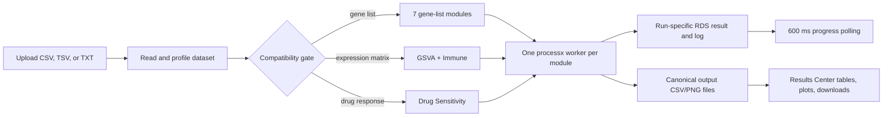

# OncoProfilingTools

OncoProfilingTools is an R package and Shiny research application for oncology profiling workflows. The package provides Bioconductor-style assay containers and DepMap/PRISM loading utilities; the Shiny application exposes ten analysis modules behind one upload, compatibility, background-worker, progress, and Results Center workflow.

This README reflects repository state `70b5cfb` on 2026-07-28. The user interface calls the components “agents,” but the current implementation uses deterministic R analysis functions and rule-based result summaries; no large-language-model call is present in the repository.

> Research use only. Biological findings require expert validation.

## Implemented analysis modules

| Module | Active Shiny backend | Required input | Saved table | Saved visualization |
|---|---|---|---|---|
| GO | `clusterProfiler::enrichGO`, Biological Process ontology | Gene list | `output/cms4/go_results.csv` | `output/visualizations/go_biological_process_dotplot.png` |
| KEGG | `clusterProfiler::enrichKEGG`, human organism code `hsa` | Gene list | `output/cms4/kegg_results.csv` | `output/visualizations/kegg_pathway_dotplot.png` |
| Reactome | `ReactomePA::enrichPathway` | Gene list | `output/reactome/reactome_results.csv` | `output/reactome/reactome_pathways.png` |
| WikiPathways | `clusterProfiler::enrichWP` for Homo sapiens | Gene list | `output/wikipathways/wikipathways_results.csv` | `output/wikipathways/wikipathways_pathways.png` |
| STRING | `STRINGdb` mapping and interaction retrieval; top hubs ranked by degree | Gene list | `output/string/string_hub_proteins.csv` | Not generated |
| Hallmark | `msigdbr` Hallmark collection plus `clusterProfiler::enricher` | Gene list | `output/hallmark/hallmark_results.csv` | `output/hallmark/hallmark_pathways.png` |
| ChEA | `enrichR` database `ChEA_2022` | Gene list | `output/chea_cms4/chea_results.csv` | `output/chea_cms4/chea_tf_dotplot.png` |
| GSVA | `GSVA` over the MSigDB Hallmark collection; Gaussian kernel | Expression matrix | `output/gsva_bowel/gsva_hallmark_scores.csv` | `output/gsva_bowel/gsva_hallmark_heatmap.png` |
| Immune Deconvolution | `immunedeconv::deconvolute`, default method `quantiseq` | Expression matrix | `output/immune/immune_cell_composition.csv` | Not generated |
| Drug Sensitivity | In-process ranking of long-form response tables or wide PRISM-style tables | Drug-response table | `output/drug/drug_sensitivity_results.csv` | Not generated |

The package-level `R/agent-wikipathways.R` uses the MSigDB WikiPathways collection, while the active Shiny executor in `shiny-app/run_real_agents.R` uses `clusterProfiler::enrichWP`. The table above describes the active Shiny path.

## Workflow



The application:

- accepts `.csv`, `.tsv`, and `.txt` uploads up to the configured 1 GB Shiny request limit;
- validates that the table is non-empty;
- profiles gene-list, expression-matrix, and drug-response compatibility;
- disables incompatible module selectors and automatically checks compatible modules;
- saves the uploaded table once per run as `shiny-app/runtime/<run-id>/input.rds`;
- launches selected modules independently with `processx`;
- polls worker result files every 600 ms and Results Center files every 750 ms;
- reports queued, running, completed, failed, and not-executed states;
- exposes searchable `DT` tables, available plots, per-module CSV downloads, a combined HTML report action, and a ZIP bundle action;
- kills active workers when the session ends; and
- clears known result files and earlier runtime entries at app startup, on a new upload, and before a new run.

## Compatibility rules

The active compatibility logic is in `shiny-app/app.R`.

### Gene-list modules

A gene-list table is compatible when:

1. a column name normalizes to one of `genesymbol`, `hugosymbol`, `gene`, `genes`, `symbol`, `genename`, or `hgncsymbol`; and
2. at least two cleaned, unique gene values remain.

Compatible modules: GO, KEGG, Reactome, WikiPathways, STRING, Hallmark, and ChEA.

### Expression modules

The active UI gate requires:

- at least 10 columns in the uploaded table;
- at least 10 cleaned genes from a recognized gene column; and
- at least two columns whose values are at least 80% numeric.

Compatible modules: GSVA and Immune Deconvolution.

The executor ultimately requires genes in rows and at least two numeric sample columns. The current UI gate is stricter than the executor. The local `data/OmicsExpression_Bowel_TPMLogp1.csv` file is stored as samples × genes and has no recognized gene-column header, so it is not enabled by the current active UI gate when uploaded unchanged.

### Drug Sensitivity

The module is compatible with either:

- a compound column (`compound`, `compoundname`, `drug`, `drugname`, or `treatment`) plus a response column (`ic50`, `auc`, `viability`, `sensitivity`, `response`, or `lnic50`); or
- a wide table with one or more column names containing `BRD:`.

For IC50, AUC, or viability column names, lower mean response is ranked as more sensitive. Other accepted response names are ranked in descending mean order.

### CMS4 dataset

The local `data/gene_expression_CMS4.csv` has 19,215 rows, 5 columns, and a detected `hugo_symbol` column. Under the current UI logic it enables the seven gene-list modules and does not enable GSVA, Immune Deconvolution, or Drug Sensitivity.

## Repository structure

```text
OncoProfilingTools/
├── R/                         S4 classes, assay loaders, plotting, and agent functions
├── api/plumber.R              Four-agent REST API: GO, KEGG, GSVA, ChEA
├── data/                      Local ignored datasets, including CMS4 and DepMap files
├── inst/extdata/              Small tracked example gene list
├── man/                       Generated R documentation
├── scripts/                   Dataset preparation, analysis, plotting, and legacy tests
├── shiny-app/
│   ├── app.R                  Active UI, compatibility, reactive state, and orchestration
│   ├── real_pipeline.R        Run-directory and processx helpers
│   ├── run_agent_worker.R     Single-module background worker entry point
│   ├── run_real_agents.R      Active ten-module execution backend
│   ├── results_helpers.R      Results Center and download builders
│   └── www/                   Client-side status handling and responsive styling
├── output/                    Local/ignored analysis outputs; some historical reports remain
├── DESCRIPTION                R package metadata and declared dependencies
└── NAMESPACE                  Exported package API
```

`backup-before-combined-report/`, `repair-backup/`, and archived result directories are historical evidence, not the active application path.

## Requirements

- R 4.1.0 or newer, as declared in `DESCRIPTION`
- A browser supported by Shiny
- Network access for backends that query or download external resources, including ChEA/Enrichr, KEGG, STRING, Reactome, MSigDB data, DepMap downloads, and package installation

The package metadata declares the core assay and enrichment dependencies. The Shiny source also directly requires packages not fully represented in `DESCRIPTION`, including `shiny`, `readr`, `DT`, `processx`, `htmltools`, `base64enc`, `enrichR`, `GSVA`, `pheatmap`, and `ggplot2`.

## Installation

From the repository root:

```r
if (!requireNamespace("pak", quietly = TRUE)) {
  install.packages("pak")
}

pak::pkg_install(".", ask = FALSE)
```

For the complete Shiny platform, verify the source-referenced runtime packages:

```r
install.packages(c(
  "shiny", "readr", "DT", "processx", "htmltools", "base64enc",
  "ggplot2", "pheatmap", "enrichR", "msigdbr", "tibble",
  "dplyr", "data.table", "httr2", "openxlsx", "remotes"
))

if (!requireNamespace("BiocManager", quietly = TRUE)) {
  install.packages("BiocManager")
}

BiocManager::install(c(
  "clusterProfiler", "org.Hs.eg.db", "ReactomePA", "STRINGdb", "GSVA",
  "S4Vectors", "SummarizedExperiment", "MultiAssayExperiment",
  "SingleCellExperiment"
))

remotes::install_github("omnideconv/immunedeconv")
```

The `enumr` remote is declared in `DESCRIPTION` as `ElianHugh/enumr@main`.

## Run locally

```bash
cd /Users/bandaarjunreddy/Research/OncoProfilingTools
Rscript -e 'shiny::runApp("shiny-app", launch.browser=TRUE)'
```

To create the requested `onco` shortcut in `~/.zshrc`:

```bash
alias onco="cd /Users/bandaarjunreddy/Research/OncoProfilingTools && Rscript -e 'shiny::runApp(\"shiny-app\", launch.browser=TRUE)'"
```

Reload the shell, then run:

```bash
source ~/.zshrc
onco
```

If the repository is cloned elsewhere, replace the path in the alias.

## Using the application

1. Upload a non-empty CSV, TSV, or tab-delimited TXT file.
2. Confirm the displayed row, column, gene, and compatible-module counts.
3. Review the compatibility badges. Incompatible modules are disabled.
4. Leave all compatible modules selected or clear modules you do not want to run.
5. Select **Run analysis**.
6. Monitor the per-module progress rows and completed/failed counter.
7. Review each selected module in the Results Center.
8. Download individual CSVs or the run-level outputs that are available.
9. Treat result interpretations as rule-based summaries and validate biological conclusions independently.

## Package data model

The R package is broader than the Shiny interface:

- `OncoExperiment` subclasses `MultiAssayExperiment` and adds project, version, model, and graph slots.
- `ExpressionAssay`, `ProteinExpressionAssay`, `MutationAssay`, and `DrugResponseAssay` subclass `SummarizedExperiment`.
- The assay registry supports DepMap expression, protein expression, mutation, and PRISM response files plus their sidecar metadata.
- `download_assays()` queries the DepMap files API and caches downloads.
- `load_assays()` resolves registered filenames, calls the matching loader, and aligns metadata.
- `subset()` evaluates a logical expression against top-level `colData()`.
- `compare_drug_sensitivities()` runs per-drug Welch tests between two groups and returns a `DrugSensitivityComparison`.
- `export()` can write the comparison table and plots to an Excel workbook.
- `plot_donut()` visualizes categorical assay metadata.

These package utilities are not exposed as separate cards in the current Shiny interface.

## Verification status

Repository-grounded checks performed on 2026-07-28:

- all 76 tracked R files parsed successfully;
- active and historical `status.js` files passed JavaScript syntax checking;
- `shiny-app/app.R` sourced successfully in an isolated copy and returned a `shiny.appobj`;
- the CMS4 table produced 19,215 cleaned genes from `hugo_symbol`;
- the final expression-matrix preparer produced genes-as-rows output in a local smoke check; and
- stored `shiny-app/runtime-test/*-result.rds` artifacts report successful historical runs for GO (130 rows), KEGG (1 row), GSVA (50 rows), and ChEA (730 rows).

The tracked `shiny-app/test_all_real_workers.R` harness covers only those four modules and currently references `output/cms4_fc2/cms4_fc2_degs.csv`, which is not present in the working repository. A reproducible end-to-end ten-module test suite is **Not verified from repository.**

## Screenshots

A current application screenshot is **Not verified from repository.** The tracked PNG files are archived scientific result plots rather than UI screenshots.

## Current limitations and future work

- Extend `api/plumber.R`, whose advertised and allowed module list remains GO, KEGG, GSVA, and ChEA.
- Replace or extend the four-module `test_all_real_workers.R` harness with fixtures and assertions for all ten modules.
- Repair the combined Results Center report builder: its title map omits WikiPathways and Hallmark, producing `subscript out of bounds`, and its introductory copy still names only GO, KEGG, GSVA, and ChEA.
- Align the expression compatibility gate with the executor or activate the existing orientation-normalization helpers.
- Isolate canonical outputs by session/run. Runtime inputs and worker result files are run-specific, but scientific CSV/PNG destinations are global.
- Add `output/string/string_interactions.csv` to cleanup and download coverage; the current known-file map includes only the STRING hub table.
- Remove unresolved conflict markers from `.gitignore`.
- Add a current UI screenshot and a documented, reproducible ten-module validation run.
- Bring all Shiny/runtime packages into `DESCRIPTION` so a package installation expresses the full application dependency set.
