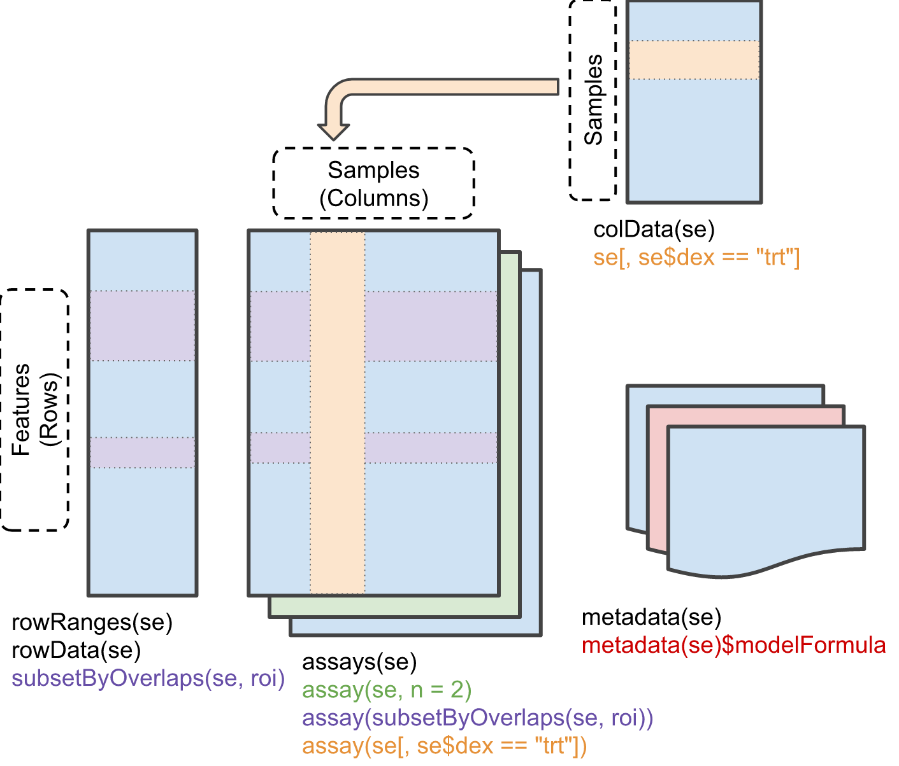

# Getting started

## Understanding the structure

Before starting to interact with the package you should understand the
structure of the objects you’ll be working with. OPT borrows and expands
from well-known Bioconductor packages for dealing with large-scale
experimental data. The following two objects are the most important to
understand:

1.  **`OncoExperiment`** - a class that inherits from
    [MultiAssayExperiment](https://bioconductor.org/packages/release/bioc/html/MultiAssayExperiment.html).
    It contains all the information needed to perform downstream
    analyses in the form of assays.
2.  **`*Assay`** - a class that inherits from
    [SummarizedExperiment](https://bioconductor.org/packages/release/bioc/html/SummarizedExperiment.html).
    Different types of assays exist to support loading various sources
    with different structures. Some examples include:
    [`RNAAssay`](https://tycgenomicslab.github.io/OncoProfilingTools/articles/),
    [`DrugResponseAssay`](https://tycgenomicslab.github.io/OncoProfilingTools/articles/),
    and
    [`PRISMAssay`](https://tycgenomicslab.github.io/OncoProfilingTools/articles/).

## `OncoExperiment`

The `OncoExperiment` is the core object that contains all the
information. It harmonizes all the assays (or experiments) together and
maps them to the samples. OncoExperiment is primarily a
`MultiAssayExperiment` (`MAE`) with a few additional methods to deal
with oncogenic data. Although this guide will summarize the structure to
a degree, the authors of `MAE` have created some wonderful [quick start
guides](https://bioconductor.org/packages/release/bioc/vignettes/MultiAssayExperiment/inst/doc/QuickStartMultiAssay.html)
and
[cheatsheets](https://bioconductor.org/packages/release/bioc/vignettes/MultiAssayExperiment/inst/doc/MultiAssayExperiment_cheatsheet.html)
with in-depth information. Please refer to these if you ever need help
navigating an `OncoExperiment` you’ve created.

>   
> Credit: [“Software For The Integration of Multi-Omics Experiments In
> Bioconductor.” Marcel Ramos et.
> al.](https://bioconductor.org/packages/release/bioc/vignettes/MultiAssayExperiment/inst/doc/MultiAssayExperiment.html)

### Slots

A quick overview of the slots you should know about in an
`OncoExperiment`:

- **`project_name`** - The name of the project for your own reference.
- **`ExperimentList`** - Contains all ID-based experimental data. An
  instance of `ExperimentList`. Access with
  `experiments(OncoExperiment)`.
- **`colData`** - Contains all sample-level metadata. An instance of
  `DataFrame`. Access with `colData(OncoExperiment)` or `$`.
- **`sampleMap`** - Helps to relate experiment-specific sample naming or
  replicate observations to the row names in `colData`. Access with
  `sampleMap(OncoExperiment)`.
- **`metadata`** - Storing any additional metadata about the study. This
  is free to include anything. We store some basic information as a
  `list`. Individual assays can store additional metadata in their own
  `metadata` slot. Access with `metadata(OncoExperiment)`.

This quick start guide by the Waldron Lab has a lot more great
information: [Quick Start
Guide](https://bioconductor.org/packages/release/bioc/vignettes/MultiAssayExperiment/inst/doc/QuickStartMultiAssay.html).
There is also a lot of useful examples showing these accessors in use.

### Creating an `OncoExperiment`

``` r

exp <- OncoExperiment(project_name = "Murine RNA-Seq 04")
exp
```

    ## An OncoExperiment object
    ## Project Name: Murine RNA-Seq 04 
    ## Version: 0.1.0 
    ## Experiments: none

### Subsetting

To demonstrate accessing the data in an `OncoExperiment`, let’s
construct a simple example with an `RNAAssay`. We’ve created an example
file with a 5x5 table. Rows contain unique sample names and colums
contain unique gene names. The values are random numbers between 1 and
10. We can peek at it to demonstrate how it is structured:

``` r

head(read.csv("assets/rna_example.csv", header = TRUE, sep = ","))
```

    ##      ModelID TSPAN6..7105. TNMD..64102. DPM1..8813. SCYL3..57147. FIRRM..55732.
    ## 1 ACH-001113      4.956577     0.000000    7.577648      3.179411      4.765742
    ## 2 ACH-001289      4.955015     0.617117    7.333933      2.782935      3.735371
    ## 3 ACH-001339      3.421952     0.000000    7.546069      2.615880      4.476233
    ## 4 ACH-001619      5.196729     0.000000    6.362268      2.144996      3.087183
    ## 5 ACH-001979      4.651643     0.000000    5.946408      2.454515      1.852111

Now let’s load the data into an OncoExperiment:

``` r

# let's create a simple 5x5 table to load
example <- OncoExperiment(project_name = "Example")
example <- load_assays(example, AssayTypes$RNA, data = "assets/rna_example.csv")
example
```

    ## An OncoExperiment object
    ## Project Name: Example 
    ## Version: 0.1.0 
    ## Experiments: RNA 
    ## 
    ## Experiment summary:
    ##  experiment    class   dim
    ##         RNA RNAAssay 5 x 5

#### Single Bracket

Test Test

## `*Assay`


