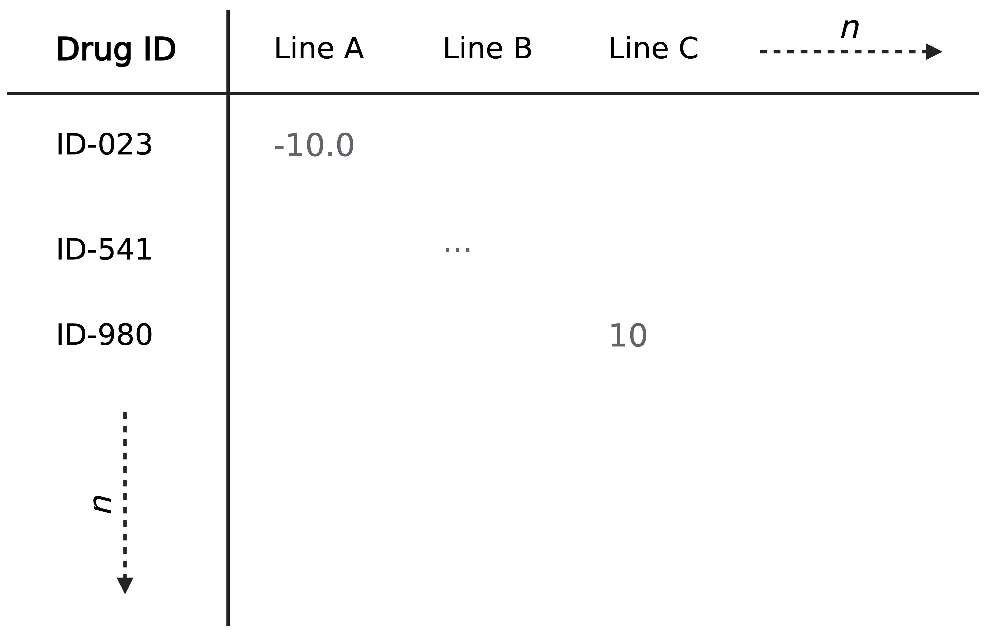

```{r setup, include=FALSE}
knitr::opts_chunk$set(warning = FALSE, message = FALSE)
library(dplyr)
```

# Format
For a log-fold change drug response assay (DRA), your data should be formated with cell lines as columns and drugs as rows. The first column is expected to be the drug identifiers. For example:



## Metadata
Providing metadata is optional but will likely accompany your data. Metadata should be provided in a separate tab-delimited file. The first column should still be the same drug identifiers that can be mapped to those listed in the data file. Here is an example of a metadata file:

```{r example-metadata, eval=TRUE, message=FALSE, warning=FALSE, echo=FALSE}
csv <- read.csv("assets/dra_metadata_example.csv")
knitr::kable(head(csv))
```

# Loading
Loading a DRA is achieved similarly to other assays. For this example we will load in metadata but this is optional. We've created `csv` files with some 50x50 dummy data to act as our example:
```{r example-load, eval=TRUE, message=FALSE, warning=FALSE}
library(OncoProfilingTools)
library(MultiAssayExperiment)
library(SummarizedExperiment)

exp <- OncoExperiment(project_name = "Example DRA")
exp <- load_assays(
  object = exp,
  assay_type = AssayTypes$DrugResponse,
  data = "assets/dra_example.csv",
  metadata = "assets/dra_metadata_example.csv"
)

exp
```

# Navigating data
Your `OncoExperiment` links all your experimental assays using the identifiers provided in your files. We can check that they loaded in correctly by observing the `colData` (see [MultiAssayExperiment](https://bioconductor.org/packages/release/bioc/vignettes/MultiAssayExperiment/inst/doc/QuickStartMultiAssay.html) for more information on this):
```{r example-coldata, eval=TRUE, message=FALSE, warning=FALSE}
head(colData(exp))
```

## Access raw values
If you need to look at the raw values of your data or interact with them directly, you can access the `DrugResponseAssay` (instance of `SummarizedExperiment`) object directly.
```{r example-raw, eval=TRUE, message=FALSE, warning=FALSE}
dra <- experiments(exp)$DrugResponse # access by whatever you named the assay
dra
```

### Get matrix of raw values
The raw values are stored in the `assays` slot of the `SummarizedExperiment` object. Accessing them is relatively straightforward. In this example, we'll just print the first 3 rows of the matrix as an example. You should see drug names as row names and cell line names as column names.
```{r example-raw-matrix, eval=TRUE, message=FALSE, warning=FALSE}
dra_matrix <- assays(dra)$response # TODO: future function will make this easier (i.e. get_values(...)
knitr::kable(head(dra_matrix, n=3L))
```

### Look at metadata
If you loaded metadata alongside the assay, it will be stored in the `rowData` slot of the `SummarizedExperiment` object. The `rownames` are the drug identifiers and `rowData` is the associated metadata.
```{r example-rowdata, eval=TRUE, message=FALSE, warning=FALSE}
metadata <- rowData(dra)
knitr::kable(head(metadata, n=3L))
```

> ⚠️ This is not to be confused with the `metadata()` function or slot. This returns a DataFrame of any metadata associated with the assay, not the samples themselves. This could contain anything from citation information, data about the file source, etc.
