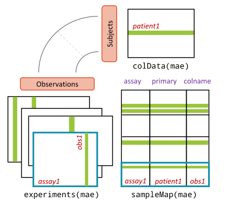

```{r setup, include=FALSE}
knitr::opts_chunk$set(warning = FALSE, message = FALSE)
```


# Understanding the structure

Before starting to interact with the package you should understand the structure of the objects you'll be working with. OPT borrows and expands from well-known Bioconductor packages for dealing with large-scale experimental data. The following two objects are the most important to understand:

1. **`OncoExperiment`** - a class that inherits from [MultiAssayExperiment](https://bioconductor.org/packages/release/bioc/html/MultiAssayExperiment.html). It contains all the information needed to perform downstream analyses in the form of assays.
2. **`*Assay`** - a class that inherits from [SummarizedExperiment](https://bioconductor.org/packages/release/bioc/html/SummarizedExperiment.html). Different types of assays exist to support loading various sources with different structures. Some examples include: [`RNAAssay`](), [`DrugResponseAssay`](), and [`PRISMAssay`]().


# `OncoExperiment`
The `OncoExperiment` is the core object that contains all the information. It harmonizes all the assays (or experiments) together and maps them to the samples. OncoExperiment is primarily a `MultiAssayExperiment` (`MAE`) with a few additional methods to deal with oncogenic data. Although this guide will summarize the structure to a degree, the authors of `MAE` have created some wonderful [quick start guides](https://bioconductor.org/packages/release/bioc/vignettes/MultiAssayExperiment/inst/doc/QuickStartMultiAssay.html) and [cheatsheets](https://bioconductor.org/packages/release/bioc/vignettes/MultiAssayExperiment/inst/doc/MultiAssayExperiment_cheatsheet.html) with in-depth information. Please refer to these if you ever need help navigating an `OncoExperiment` you've created.


>   <br>
> Credit: ["Software For The Integration of Multi-Omics Experiments In Bioconductor." Marcel Ramos et. al.](https://bioconductor.org/packages/release/bioc/vignettes/MultiAssayExperiment/inst/doc/MultiAssayExperiment.html)

## Slots
A quick overview of the slots you should know about in an `OncoExperiment`:

- **`project_name`** - The name of the project for your own reference.
- **`ExperimentList`** - Contains all ID-based experimental data. An instance of `ExperimentList`. Access with `experiments(OncoExperiment)`.
- **`colData`** - Contains all sample-level metadata. An instance of `DataFrame`. Access with `colData(OncoExperiment)` or `$`.
- **`sampleMap`** - Helps to relate experiment-specific sample naming or replicate observations to the row names in `colData`. Access with `sampleMap(OncoExperiment)`.
- **`metadata`** - Storing any additional metadata about the study. This is free to include anything. We store some basic information as a `list`. Individual assays can store additional metadata in their own `metadata` slot. Access with `metadata(OncoExperiment)`.

This quick start guide by the Waldron Lab has a lot more great information: [Quick Start Guide](https://bioconductor.org/packages/release/bioc/vignettes/MultiAssayExperiment/inst/doc/QuickStartMultiAssay.html). There is also a lot of useful examples showing these accessors in use.

```{r mini-demo, eval = TRUE, message = FALSE, warning = FALSE, include=FALSE}
library(OncoProfilingTools)
library(MultiAssayExperiment)
library(SummarizedExperiment)
data(miniACC) # loads example
miniACC

colData(miniACC)[4:8, 4:8]
experiments(miniACC)
# You can also access the expeirment itself by its' name
experiments(miniACC)$RNASeq2GeneNorm
# Shows you how the unique names relate between experiments to link data
sampleMap(miniACC)
metadata(miniACC)
```


## Creating an `OncoExperiment`
```{r, eval = TRUE}
exp <- OncoExperiment(project_name = "Murine RNA-Seq 04")
exp
```

## Subsetting
To demonstrate accessing the data in an `OncoExperiment`, let's construct a simple example with an `RNAAssay`.
We've created an example file with a 50x50 table. Rows contain unique sample names and colums contain unique gene names. The values are random numbers between 1 and 10. We can peek at it to demonstrate how it is structured:
```{r, eval=TRUE, include=FALSE}
library(dplyr)
```
```{r, eval=TRUE}
head(read.csv("assets/rna_example.csv", header = TRUE, sep = ","))
```

Now let's load the data into an OncoExperiment:
```{r, eval=TRUE}
example <- OncoExperiment(project_name = "Example")
example <- load_assays(example,
                       AssayTypes$RNA,
                       data = "assets/rna_example.csv",
                       metadata = "assets/rna_metadata_example.csv")
example
```

### Logical Indexing
You can use logical operations to subset data based on the rows or columns using the `$` operator. Like in other libraries, you can use `==`, `!=`, `<`, `>`, `<=`, and `>=` to filter your data. All experiments and assays will be automatically harmonized.

In our example data, the metadata file contains a column called `AgeCategory`. Let's say we want to subset by all samples where patients are adults and filter out unknown or pediatric samples. We can do this by creating a logical vector and using it to subset the `OncoExperiment` object:
```{r, eval=TRUE}
is_metastatic <- example$PrimaryOrMetastasis == "Metastatic" # returns logical vector
metastatic <- example[, is_metastatic]
metastatic
```
We removed ~30 samples and were left with only samples that met our criterion. If we had additional assays, they would have been simultaneously reduced.

### Standard Indexing
If you require more fine-grained control, you can subset by specific indices:
```{r, eval=FALSE}
OncoExperiment[i = rownames, j = primary or colnames, k = assay]
```

For example, we can do the same example as above by using standard indexing:
```{r, eval=TRUE}
example[, example$PrimaryOrMetastasis == "Metastatic", "RNA"]
```

### Functions
`MultiAssayExperiment` has a number of useful functions for subsetting or intersecting. The previous examples will likely be the most common ones you'll use. For more specific use cases, please refer to the [MultiAssayExperiment documentation](https://waldronlab.io/MultiAssayExperiment/reference/subsetBy.html).

# `*Assay`
A select number of data formats for different types of experiments are currently supported and have been inspired by the oncogenic files hosted at [DepMap](https://depmap.org/portal/). Currently, we support:

| Name                                                    | Purpose                                                                                                                                                           |
|:--------------------------------------------------------|:------------------------------------------------------------------------------------------------------------------------------------------------------------------|
| [`RNAAssay`](/articles/RNAAssay.html)                   | Cell line vs. gene expression matrix for RNA-seq data. Useful for understanding gene expression patterns in different cell lines.                                 |
| [`DrugResponseAssay`](/articles/DrugResponseAssay.html) | Drugs vs cell lines with log-fold change drug response values. Useful for [PRISM](https://depmap.org/repurposing/)-like data to understand therapeutic responses. |


## Structure
All assays have their own S4 class but ultimately inherit from [`SummarizedExperiment`](https://bioconductor.org/packages/release/bioc/html/SummarizedExperiment.html). This means that you can use the same accessors and methods to interact with them. For example, you can use `assays()` to access the raw values, `rowData()` to access any metadata associated with the rows, and `colData()` to access any metadata associated with the columns. Here is a helpful graphic:

> >
> Credit: [Morgan M, Obenchain V, Hester J, Pagès H (2026). SummarizedExperiment: A container (S4 class) for matrix-like assays. doi:10.18129/B9.bioc.SummarizedExperiment. R package version 1.42.0, https://bioconductor.org/packages/SummarizedExperiment.](https://www.bioconductor.org/packages/release/bioc/html/SummarizedExperiment.html)


## Enumerator
This package provides a helpful enumerator for seeing and accessing all available assay types. This just helps with code suggestions, prevents typos, and makes it easy to see what's available.
```{r, eval=TRUE, error = TRUE}
AssayTypes # see all options
AssayTypes$RNA # easy to access their character vector
AssayTypes$DoesNotExist # if you make a typo, you'll get an error
```

```{r, eval=TRUE}

sessionInfo()
```
